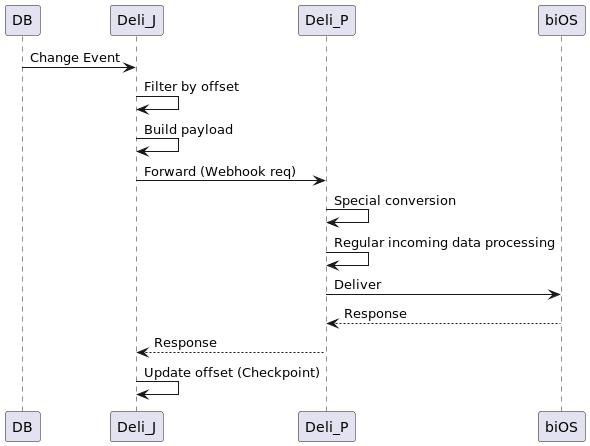

# Deli CDC Service Design

## CDC Proxy

When enabled, Deli-P webhook service accepts CDC import sources by using Deli-J
as a proxy to convert CDC input to JSON incoming records. The purpose is to support
UDF in transforming import sources which is not yet supported by Deli-J that provides
CDC import capability.

### Configuration

Integrations schema is seamless to this mode. Both Deli-J and Deli-P should translate the schema
and change behavior.

In order to enable the proxy mode, set property `io.isima.integrations.cdc.proxy.enabled=true`
in Deli-J, and `cdcProxyEnabled=true` in section `[Webhook]` in Deli-P. Optionally, Deli-J
provides following properties (values are default):

- `io.isima.integrations.cdc.proxy.destinationUrl=http://localhost:8081`
- `io.isima.integrations.cdc.proxy.userHeaderName=x-bios-username`
- `io.isima.integrations.cdc.proxy.passwordHeaderName=x-bios-password`

while Deli-P provides following in section `[Webhook]`:

- `cdcProxyUserHeaderName = x-bios-username`
- `cdcProxyPasswordHeaderName = x-bios-password`

### Data Flow

#### Outline

Deli-J imports DB change information using CDC import sources. Deli-J itself does not process
incoming data; it just converts detected rows and metadata into JSON objects. Those source records
are sent to Deli-P via webhook where incoming data transformation and delivery to biOS happens.

The end-to-end data flow looks as follows:



The special conversion in the diagram will be mentioned later.

#### Webhook Payload

An import data object forwarded to webhook looks as follows. It consists of records that are
detected rows in DB and metadata that helps to enrich the data.

```
{
  "record": {
    // incoming data that carries columns in a row,
    // property names are DB column names (i.e., source attribute names)
  },
  "metadata": {
    "operationType": "Create", // Create, Update, or Delete
    "tableName": "the_teable_name",
    "operationTimestamp": 12345, // epoch ms
  }
}
```

#### Webhook Endpoint

We assume the data forwarding happens within a bios-integrations docker container so the host name
and the port number are fixed. A webhook endpoint is determined by import source ID:

```
http://localhost:8081/__cdc/{importSourceId}
```

where importSourceId identifies the CDC import source.

#### Authentication

Authentication is needed to protect the webhook endpoint. We use HTTP header plain text
authentication.

The user name and the password are available in the schema. We read them from the destination config
for the flow.

#### Special Conversion in Webhook

When the incoming source is CDC, the webhook takes the metadata in the payload and puts the
properties into the header fields area, then the transformation part can pick them up. For example,
following flow config can pick up operation type and deliver to biOS:

      "dataPickupSpec": {
        "attributeSearchPath": "",
        "attributes": [
          {
            "sourceAttributeName": "user_id",
            "as": "userId"
          },
          {
            "sourceAttributeName": "product_id",
            "as": "productId"
          },
          {
            "sourceAttributeName": "item_name",
            "as": "itemName"
          },
          {
            "sourceAttributeName": "${operationType}",
            "as": "activity"
          }
        ]
      },

### Schema

There should be no schema changes externally. It should look to be a regular CDC flow configuration.
There must be no special schema properties for proxying, although several local configuration
parameters are necessary in order to enable the proxy-mode service.

Internally, both Deli-J and Deli-P should interpret the CDC flow config and keep translated schema
in the process. But such interpreted schema should not be uploaded to the server. Each Deli node
should translate the schema and keep it internally and independently.

#### Schema Translation for the Webhook Service

CDC import sources need to be translated to Webhooks as follows:

in ImportSourceConfig:

- importSourceId: as is
- importSourceName: original name + (modified {orig_type} -> webhook)
- type: {the_cdc_type} to Webhook
- webhookPath: `__cdc/{importSourceId}`
- authentication
    - type: `HttpHeaderPlain`
    - userHeader: `x-bios-username`
    - passwordHeader: `x-bios-password`

Then, the Deli-P uses this translated import schema as webhook data sources and loads the rest (
downstream config) as normal flows.

In order to connect the source and the flow config properly, source data spec of each flow config
also needs translation as follows:

in SourceDataSpec:

- importSourceId: as is
- payloadType: always JSON
- webhookSubPath: importFlowId

Lastly, the dataPickupSpec for each flow config needs modification:

in DataPickupSpec:

- attributeSearchPath: `records/*`
- deletionSpec:
- sourceAttributeName: `/metadata/operationType`
- condition: `lambda type: type == 'Delete'`

#### Webhook Destination for CDC Service

Deli-J CDC service needs a special destination of type Webhook for each CDC import source as
follows:

in ImportDestinationConfig:

- importDestinationId: borrow importSourceId to make the value consistent among nodes
- importDestinationName: source name + (webhook)
- type: Webhook (new type)
- endpoint: `http://localhost:8081/__cdc/{importSourceId}`

then the remote endpoint when sending data via webhook would be

```
http://localhost:8081/__cdc/{importSourceId}/{tableName}
```

The flow id is necessary in order to route the request to proper flow in the webhook service.

Flow config translation is not necessary, but the service should skip the incoming record
transformation and put all received rows (and columns) to the incoming data object without
transformation.

## TLS Certificates

Any types of CDC import source takes PEM root CA for server certificate if set, and PKCS12 for
client certificate. But Debezium connector underneath has different TLS configuration requirement
for each database type. Also, the certificates are configured using integrations schema, but all
DB connectors require them to be stored in files.

This section explains how the CDC importer handles TLS certificate configuration.

Currently, only following importer types support TLS:

- MySQL
- MongoDB
- PostgresSQL

### MySQL Import Source

The Debezium MySQL connector accepts

- JKS truststore as root CA
- PKCS12 for client certificate

Deli converts the root CA to truststore with following fixed parameters:

- password: secret
- alias: rootCA

Client certificate can be used as is.

The Deli MySQL service saves these certificates at:

- `${BIOS_DATA}/${importSourceId}/root-ca.crt` for root CA
- `${BIOS_DATA}/${importSourceId}/client-certificate.crt` for client certificate

They are set to debezium connector config as:

- `database.ssl.truststore` - for root CA
- `database.ssl.truststore.password` - for root CA truststore password
- `database.ssl.keystore` - for client certificate
- `database.ssl.keystore.password` - for client certificate password

### MongoDB Import Source

#### TLS configuration

The Debezium MongoDB connector accepts

- JKS truststore as root CA
- PKCS12 for client certificate

Deli converts the root CA to truststore with following fixed parameters:

- password: secret
- alias: rootCA

Client certificate can be used as is.

The Deli MySQL service saves these certificates at:

- `${BIOS_DATA}/root-ca.crt` for root CA
- `${BIOS_DATA}/client-certificate.crt` for client certificate

Here, there's a problem in Debezium MongoDB connector -- there is no connector properties to set
TLS certificates, Deli needs to use javax system properties. But TLS configuration parsing happens
*after* the application loads TLS classes initially, setting the property there is too late.

In order to solve this problem, the MongoDB importer compares the content of already-saved
certificates before saving. If the content changes, the service restarts itself to force reloading
the certificates.

They are set to debezium connector config as:

- `javax.net.ssl.trustStore` - for root CA
- `javax.net.ssl.trustStorePassword` - for root CA truststore password
- `javax.net.ssl.keyStore` - for client certificate
- `javax.net.ssl.keyStorePassword` - for client certificate password

#### X.509 Client Authentication

### PostgresSQL Import Source

The Debezium PostgresSQL connector accepts

- PEM as root CA
- PEM (certificate and private key) for client certificate

Deli uses the specified root CA as is.

Deli breaks the specified PKCS12 certificate to PEM certificate and private key.

They are stored at

- `${BIOS_DATA}/${importSourceId}/root-ca.crt` for root CA
- `${BIOS_DATA}/${importSourceId}/client-cert.pem` for client certificate
- `${BIOS_DATA}/${importSourceId}/client-key.pem` for client certificate private key

They are set to debezium connector config as:

- `database.sslrootcert` - for root CA
- `database.ssl.sslert` - for client certificate
- `database.ssl.sslkey` - for client certificate private key

